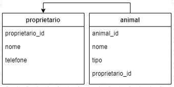
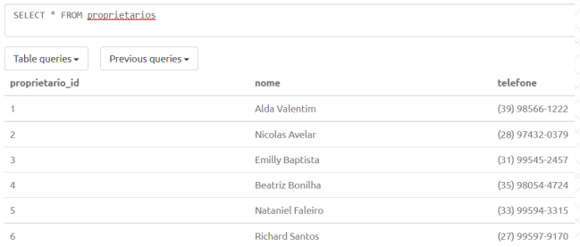
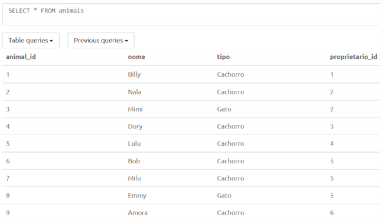

<h1 align="center">igti-node-modulo-3</h1>

[🔙 Voltar para página principal](../README.md)

# Enunciado do trabalho prático

## Objetivos
Exercitar os seguintes conceitos trabalhados no Módulo:
- Criar tabelas no PostgreSQL.
- Criar uma API com Node.js e Express.
- Criar endpoints que realizem a consulta, inserção, atualização e exclusão de registros no banco de dados.

## Enunciado
O aluno deverá criar um projeto `Node.js` com `Express` para gerenciar o cadastro de um petshop. O sistema deverá controlar o cadastro de animais e donos.

## Atividades
O aluno deverá criar um banco de dados `PostgreSQL`, chamado "**petshop**". A sugestão é que esse banco seja criado na nuvem com o [ElephantSQL](https://www.elephantsql.com/), porém se o aluno tiver familiaridade com outros servidores ou preferir instalar o banco localmente, não tem problema, pode usar o que preferir, isso não irá interferir no trabalho.

Para facilitar o trabalho de criação das tabelas, será fornecido junto a este enunciado um arquivo com os comandos de criação das tabelas. O aluno deverá copiar cada um dos comandos e executar no banco de dados criado anteriormente.

Segue abaixo os campos com seus respectivos tipos das duas tabelas:

**Tabela: proprietarios**
- `proprietario_id` (SERIAL, não nulo) – chave primária da tabela. Identificador único do registro, gerado automaticamente.
- `nome` (STRING, não nulo) – nome do proprietário.
- `telefone` (STRING, não nulo) – telefone do proprietário.

**Tabela: animais**
- `animal_id` (SERIAL, não nulo) – chave primária da tabela. Identificador único do registro, gerado automaticamente.
- `nome` (STRING, não nulo) – nome do animal.
- `tipo` (STRING, não nulo) – tipo do animal, exemplos: cachorro, gato etc.
- `proprietario_id` (INT, não nulo) – chave estrangeira para a tabela de proprietário. Faz referência a um proprietário.

Pela modelagem das tabelas, podemos observar que um proprietário pode ter vários animais, enquanto um animal só pode ter um proprietário.

O aluno deverá criar um projeto chamado "petshop-api". O projeto deverá integrar com o banco de dados PostgreSQL criado anteriormente. O uso do Sequelize é opcional para a implementação. Segue abaixo a listagem dos endpoints a serem criados, com sua URL,
tipo de método HTTP a ser utilizado e parâmetros:

**Endpoints do proprietário**

1. Criação de um proprietário
- URL: http://localhost:3000/proprietario
- Método HTTP: POST
- Parâmetros: objeto JSON com o nome e telefone do proprietário.

2. Atualização de um proprietário
- URL: http://localhost:3000/proprietario
- Método HTTP: PUT
- Parâmetros: objeto JSON com o id do proprietário que será atualizado, o nome e
telefone que serão atualizados.

3. Exclusão de um proprietário (antes de excluir um proprietário, verificar se existem animais cadastrados para ele. Caso exista, bloquear a exclusão).
- URL: http://localhost:3000/proprietario/{proprietario_id}
- Método HTTP: DELETE
- Parâmetros: id do proprietário passado diretamente na URL, exemplo de um id de
valor 15 passado na URL: http://localhost:3000/proprietario/15.

4. Consulta de todos os proprietários (retornar uma lista com todos os proprietários, sendo cada proprietário representado por um objeto JSON com todas as propriedades).
- URL: http://localhost:3000/proprietario
- Método HTTP: GET
- Parâmetros: sem parâmetros

5. Consulta de um proprietário em específico (pegar o id do proprietário e retornar um objeto JSON com suas informações)
- URL: http://localhost:3000/proprietario/{proprietario_id}
- Método HTTP: GET
- Parâmetros: id do proprietário passado diretamente na URL, exemplo de um id de
valor 15 passado na URL: http://localhost:3000/proprietario/15.

**Endpoints do animal**

1. Criação de um animal
- URL: http://localhost:3000/animal
- Método HTTP: POST
- Parâmetros: objeto JSON com o nome do animal, tipo do animal e o id do proprietário deste animal.

2. Atualização de um animal
- URL: http://localhost:3000/animal
- Método HTTP: PUT
- Parâmetros: objeto JSON com o id do animal que será atualizado, o nome, tipo e
id do proprietário do animal que serão atualizados.

3. Exclusão de um animal
- URL: http://localhost:3000/animal/{animal_id}
- Método HTTP: DELETE
- Parâmetros: id do animal passado diretamente na URL, exemplo de um id de valor 15 passado na URL: http://localhost:3000/animal/15.

4. Consulta de todos os animais (retornar uma lista com todos os animais, sendo cada
animal representado por um objeto JSON com todas as propriedades).
- URL: http://localhost:3000/animal
- Método HTTP: GET
- Parâmetros: sem parâmetros.

5. Consulta de um animal em específico (pegar o id do animal e retornar um objeto JSON com suas informações).
- URL: http://localhost:3000/animal/{animal_id}
- Método HTTP: GET
- Parâmetros: id do animal passado diretamente na URL, exemplo de um id de valor 15 passado na URL: http://localhost:3000/animal/15

6. Consulta dos animais de um proprietário em específico (pegar o id do proprietário na URL e retornar uma lista dos seus animais, sendo cada animal representado por um objeto JSON com todas as propriedades).
- URL: http://localhost:3000/animal?proprietario_id={proprietario_id}
- Método HTTP: GET
- Parâmetros: id do proprietário passado diretamente na URL, exemplo de um id de valor 15 passado na URL: http://localhost:3000/animal?proprietario_id=15 (Sugestão: pode ser usado a mesma estrutura do endpoint do item 4 que consulta todos os animais, só que aqui nesse caso ele receberia um parâmetro para filtrar o proprietário).

Antes de responder as perguntas do trabalho, crie uma nova instância do banco de dados, de forma que ela esteja limpa de registros, nas duas tabelas. Somente excluir os registros do banco de dados utilizado para o desenvolvimento não é o suficiente, pois os ids autoincrementáveis estarão com numerações diferentes de uma instância limpa.

Após ter criado a instância limpa, crie as tabelas utilizando os comandos fornecidos no arquivo juntamente com este enunciado, e execute os "inserts" que estão neste mesmo arquivo. Execute-os um por um, exatamente na mesma ordem que está no arquivo.

Pedimos isso pois durante as perguntas será solicitado o consumo de alguns endpoints para verificar o funcionamento do projeto e caso seu banco já esteja preenchido com dados de teste, isso pode gerar respostas inconsistentes.

Após a criação das tabelas e inserção dos registros e antes de prosseguir para responder o questionário, execute um "SELECT * FROM proprietarios" e um `SELECT * FROM animais`, e verifique se seus registros estão da mesma forma que as imagens abaixo.

## Respostas Finais

Os alunos deverão desenvolver a prática e, depois, responder às questões objetivas.

[🔙 Voltar para página principal](../README.md)